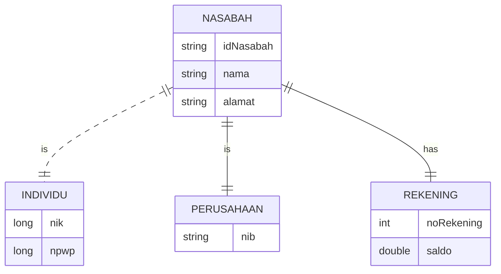
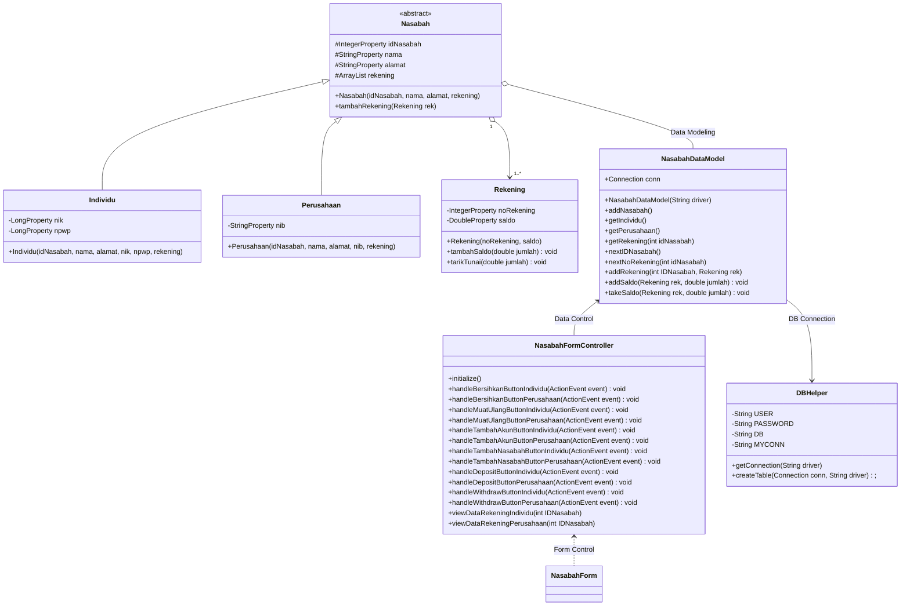

# Project Akhir PBO
# Sistem Data Nasabah

## Anggota Kelompok
- M. Mufid Sadzili (2017051011)
- Rifan Setiadi (2017051019)
- Putu Putra Eka Persada (2057051016)

## Pembagian Tugas
- M. Mufid Sadzili : Mengimplementasikan Class Diagram Nasabah, Individu dan DBHelper (Mengkoneksikan Program dengan Database)
- Rifan Setiadi : Mengembangkan Desain ERD dan Class Diagram, Mengimplementasikan Class Diagram NasabahDataModel, NasabahFormController dan NasabahForm (Membuat GUI)
- Putu Putra Eka Persada : Mengimplementasikan Class Diagram Perusahaan dan Rekening 

## Deskripsi Program
- Sistem dapat digunakan untuk merekam data nasabah di Bank berdasarkan kategori dari nasabah tersebut yaitu Individu atau Perusahaan
- Setiap nasabah dapat meiliki 1 atau lebih rekening
- Sistem dapat digunakan untuk melakukan deposit dan tarik tunai pada rekening setiap nasabah

## Design
Untuk melihat Diagram dibawah ini silahkan install mermaid-diagram plugin pada https://github.com/Redisrupt/mermaid-diagrams 

### ER DIAGRAM

### Class Diagram for JavaFX and Database

